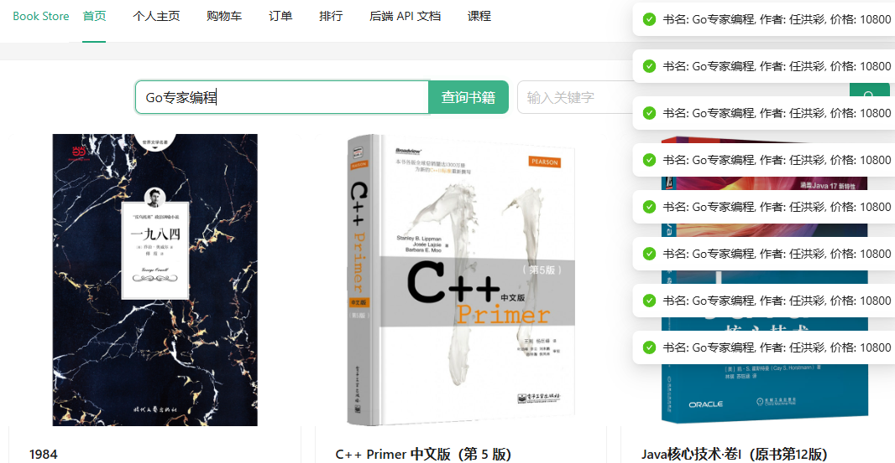
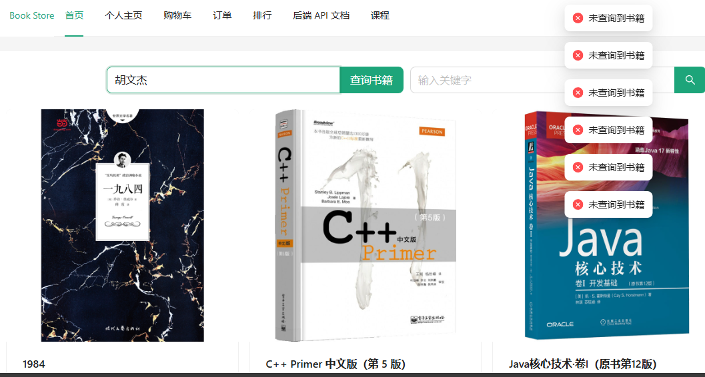
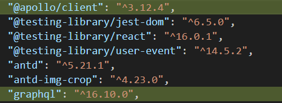
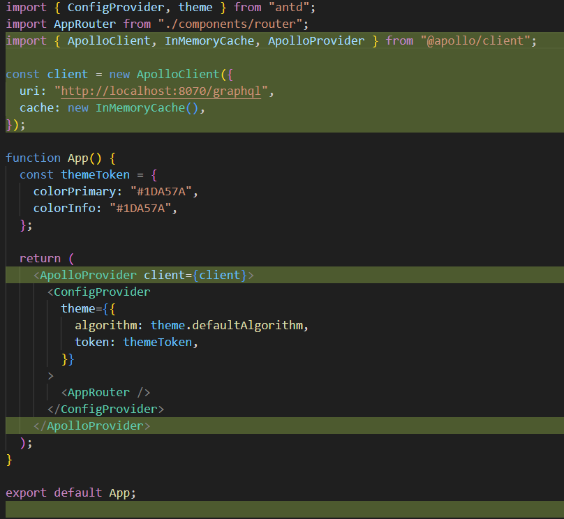
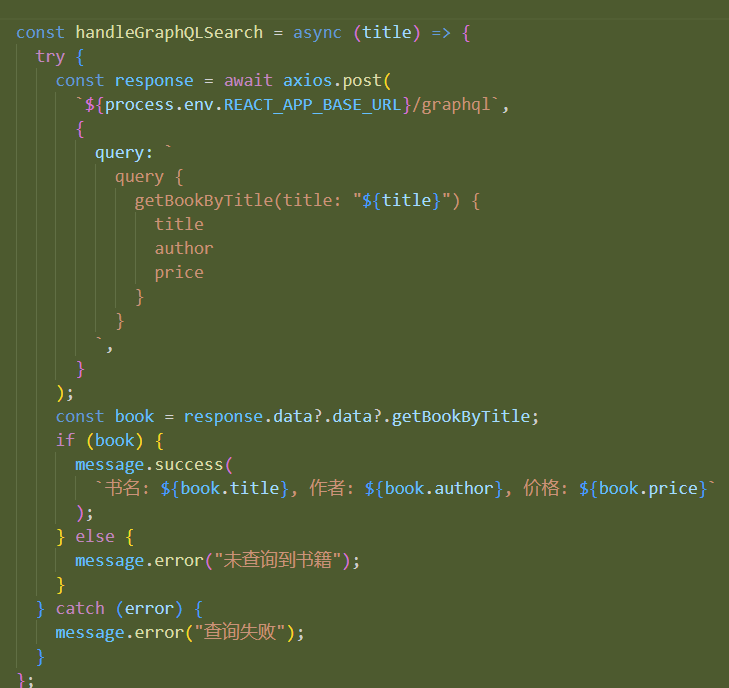
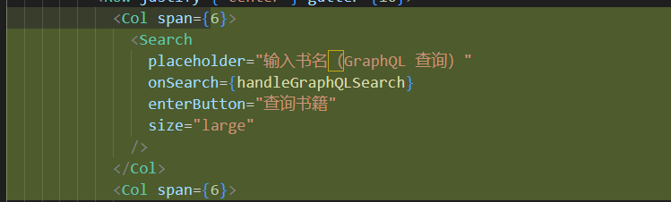
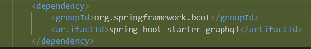
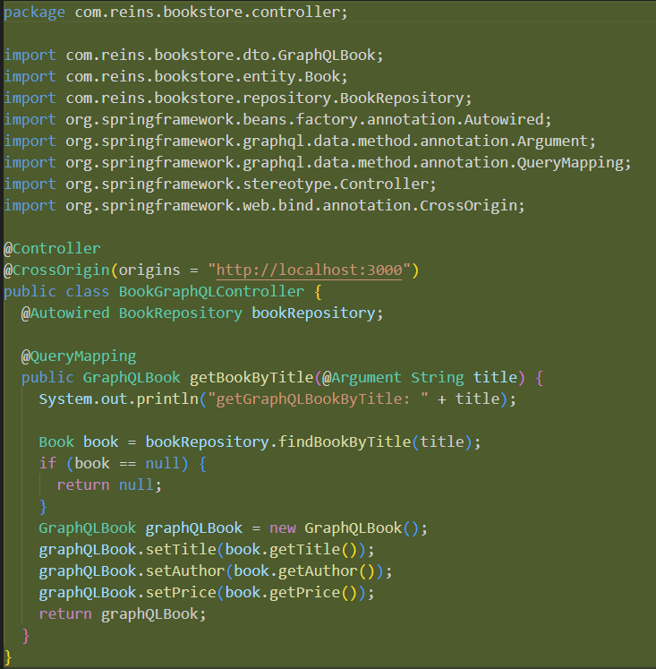
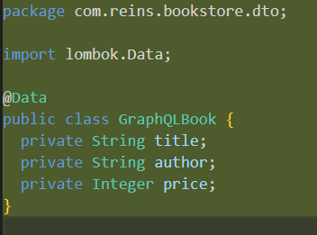
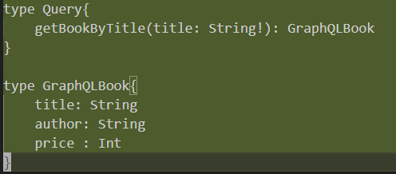

我做的比较简便，主要是前端输入书名，后端返回书名作者以及价钱。

# 前端

## 示例

## 前端代码修改

增加两个依赖

App 要用这玩意包起来

前端发送 GraphQL 请求的

前端搜索框的样式

# 后端

引入依赖

controller 里面注意@Argument，可能会遇到跨域问题。

同步增加一个这个类

下面这个文件是在 resources 里面新建一个 graphql 文件夹，里面放一个叫`schema.graphqls`文件

